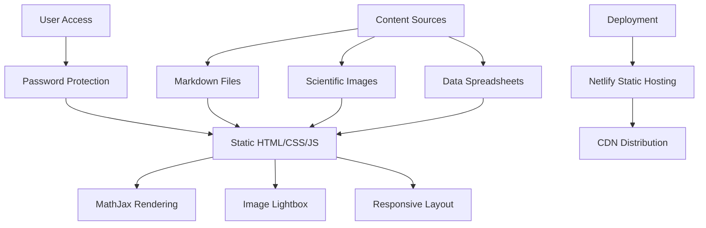

# Architecture Document: BigBounce Research Paper

## High-Level Overview

The BigBounce project is a static web application presenting a comprehensive theoretical physics research paper on spin-torsion cosmology. The architecture follows a simple, academic-focused design with no backend processing, database requirements, or complex state management.



## Module Boundaries

### 1. Content Management (`paper/`)
- **Purpose**: Organized research paper sections
- **Files**: `00-abstract.md` through `11-acknowledgments.md`
- **Format**: Markdown with LaTeX mathematical expressions
- **Dependencies**: None (pure content)

### 2. Web Presentation (`index.html`)
- **Purpose**: Interactive web interface for paper presentation
- **Features**: Password protection, MathJax integration, responsive design
- **Dependencies**: MathJax CDN, custom CSS/JS
- **Security**: Client-side password validation via session storage

### 3. Static Assets (`public/`)
- **Images**: Scientific figures in PNG format (`public/images/`)
- **Data**: Excel spreadsheets with observational constraints (`public/spreadsheets/`)
- **Access**: Direct file serving, no processing required

### 4. Development Server (`server.js`)
- **Purpose**: Local development and testing
- **Framework**: Express.js minimal server
- **Port**: 3000 (configurable)
- **Dependencies**: Express 5.1.0

## Data Flow

### Content Pipeline
```
Markdown Files → HTML Conversion → MathJax Processing → Web Display
     ↓
Scientific Images → Direct Serving → Lightbox Viewer
     ↓
Data Spreadsheets → Direct Download → External Analysis
```

### User Interaction Flow
```
User Input → Password Validation → Session Storage → Content Unlock
     ↓
Navigation → Smooth Scrolling → Section Display → Math Rendering
     ↓
Image Click → Lightbox Modal → Full-Screen View → Close Return
```

## Authentication and Security

### Password Protection
- **Method**: Client-side session storage
- **Password**: "houston" (hardcoded)
- **Storage**: `sessionStorage.authenticated`
- **Persistence**: Browser session only
- **Security Level**: Basic access control (not cryptographically secure)

### Security Considerations
- **Client-Side Keys**: Password is visible in source code
- **No Server Validation**: Authentication bypass possible
- **Static Content**: No sensitive data requiring protection
- **Recommendation**: Consider server-side authentication for production

## Error Handling

### Client-Side Errors
- **MathJax Failures**: Graceful fallback to raw LaTeX
- **Image Loading**: Alt text and error placeholders
- **JavaScript Errors**: Console logging, graceful degradation
- **Network Issues**: Offline content availability

### Content Validation
- **Mathematical Expressions**: LaTeX syntax validation
- **Image References**: Broken link detection
- **Cross-References**: Section link validation
- **Data Consistency**: Spreadsheet format verification

## External Integrations

### MathJax CDN
- **Provider**: CDN.js (Cloudflare)
- **Version**: MathJax 3.x
- **Features**: LaTeX rendering, responsive equations
- **Fallback**: Polyfill.io for ES6 support
- **Configuration**: Custom MathJax settings in HTML

### Deployment Platform
- **Provider**: Netlify
- **Configuration**: `netlify.toml`
- **Headers**: Security headers, caching policies
- **Redirects**: SPA fallback for 404s
- **Build**: No build process required

## Environment Variables

### Development Environment
- **PORT**: 3000 (Express server)
- **NODE_ENV**: development
- **No sensitive data**: All content is public

### Production Environment
- **Netlify**: Automatic environment detection
- **No build variables**: Static site deployment
- **CDN**: Automatic asset optimization

## Deployment Topology

### Development
```
Local Machine → Express Server (port 3000) → Browser
```

### Production
```
Netlify CDN → Global Distribution → User Browsers
```

### File Structure
```
/
├── index.html          # Main web interface
├── bigbounce.md        # Complete paper content
├── paper/              # Organized sections
├── public/             # Static assets
│   ├── images/         # Scientific figures
│   └── spreadsheets/   # Data files
├── server.js           # Development server
├── netlify.toml        # Deployment config
└── package.json        # Dependencies
```

## Runtime Characteristics

### Performance
- **Load Time**: < 2 seconds (static assets)
- **Math Rendering**: < 1 second (MathJax processing)
- **Image Loading**: Progressive (lightbox on-demand)
- **Memory Usage**: Minimal (no server-side processing)

### Scalability
- **Static Hosting**: Unlimited concurrent users
- **CDN Distribution**: Global edge caching
- **No Database**: No scaling concerns
- **Bandwidth**: Image optimization recommended

### Monitoring
- **Uptime**: Netlify status monitoring
- **Performance**: Web Vitals tracking
- **Errors**: Browser console logging
- **Usage**: Netlify analytics

## Component Architecture

### HTML Structure
```html
<!DOCTYPE html>
<html>
<head>
    <!-- MathJax Configuration -->
    <!-- CSS Styles -->
</head>
<body>
    <!-- Password Overlay -->
    <!-- Main Container -->
    <!-- Sidebar Navigation -->
    <!-- Content Area -->
    <!-- JavaScript -->
</body>
</html>
```

### CSS Organization
- **Reset/Normalize**: Browser consistency
- **Layout**: Flexbox-based responsive design
- **Typography**: Academic paper styling
- **Components**: Password form, navigation, lightbox
- **Responsive**: Mobile-first design approach

### JavaScript Modules
- **Authentication**: Password validation and session management
- **Navigation**: Smooth scrolling and section highlighting
- **MathJax**: Configuration and error handling
- **Lightbox**: Image modal functionality
- **Responsive**: Mobile navigation and layout adjustments

## Development Workflow

### Local Development
1. **Setup**: `npm install` (Express dependency)
2. **Server**: `node server.js` (port 3000)
3. **Access**: `http://localhost:3000`
4. **Editing**: Direct file modification with live reload

### Content Updates
1. **Markdown**: Edit `paper/*.md` files
2. **Images**: Add to `public/images/`
3. **Data**: Update `public/spreadsheets/`
4. **HTML**: Sync `index.html` with content changes

### Deployment Process
1. **Git Push**: Automatic Netlify deployment
2. **Build**: No build process required
3. **Deploy**: Static file serving
4. **CDN**: Global distribution

## Known Issues and Limitations

### Technical Limitations
- **Client-Side Security**: Password protection is cosmetic
- **No Search**: Full-text search not implemented
- **No Offline**: Requires internet for MathJax
- **No Versioning**: No content version control in UI

### Content Limitations
- **Static Content**: No dynamic updates
- **No Comments**: No peer review system
- **No Collaboration**: Single-author workflow
- **No Analytics**: Limited usage tracking

## Future Architecture Considerations

### Potential Enhancements
- **Server-Side Rendering**: Next.js for dynamic content
- **Database Integration**: PostgreSQL for collaborative features
- **Authentication**: OAuth for multi-user access
- **Real-Time Updates**: WebSocket for live collaboration
- **Search Functionality**: Elasticsearch integration
- **Version Control**: Git-based content management

### Scalability Planning
- **Content Management**: Headless CMS integration
- **Performance**: Image optimization and lazy loading
- **Accessibility**: WCAG 2.1 compliance
- **Internationalization**: Multi-language support
- **Mobile App**: React Native companion app

## How to Keep This File Fresh

- **Quarterly Reviews**: Update based on new features or dependencies
- **Performance Monitoring**: Track and optimize load times
- **Security Audits**: Review authentication and data handling
- **User Feedback**: Incorporate usability improvements
- **Technology Updates**: Stay current with web standards and tools

